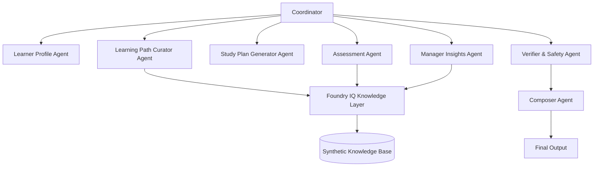

# TeamCert IQ 🎓

**Grounded Multi-Agent Certification Readiness for Role-Based Enterprise Upskilling**

[](https://github.com/sgy1023-crt/teamcert-iq)
[](https://github.com/sgy1023-crt/teamcert-iq)
[](http://localhost:3000)

---

## 🚀 Quick Start (5 Minutes)

**Never used this before? Here's how:**

### 1. Start the App
```bash
cd teamcert-iq-next
npm install
npm run dev
```
Open http://localhost:3000

### 2. Pick a Demo Scenario
You'll see **3 pre-built employee profiles** on the homepage:
- **Alex Chen** — Cloud Solution Architect, ready for AZ-204 (score: 73/100, Moderate)
- **Sarah Martinez** — Cloud Engineer, high risk (score: 51/100, High Risk)
- **Michael Kim** — DevOps Engineer, moderate readiness (score: 65/100)

👉 **Click "Alex Chen"** to see the full pipeline.

### 3. Watch the AI Work (15-20 seconds)
You'll see **7 AI agents** analyze Alex:
1. 🧑‍💼 Learner Profile Agent — "Parsed role=Cloud Solution Architect, cert=AZ-204..."
2. 🎯 Learning Path Curator — "Retrieved 3 docs, re-ranked 4 skills via Grok..."
3. 📅 Study Plan Generator — "Generated 28-day plan..."
4. 📝 Assessment Agent — "Created 4 practice questions..."
5. 🛡️ Verifier & Safety — "Audited 3 sources, 80% citation coverage..."
6. 👔 Manager Insights — "Generated coaching via Grok..."
7. 🧩 Composer — "Composed final report..."

### 4. Explore the Results (8 Tabs)

**What Each Tab Means:**

#### 📊 **Final Recommendation** (The Big Picture)
- **Readiness Ring** — Huge animated circle showing score (73/100)
  - 🔴 Red = Low (0-50) — Not ready, high failure risk
  - 🟡 Yellow = Moderate (51-75) — Needs focused prep
  - 🟢 Green = High (76-100) — Ready to schedule exam
- **Team Benchmark** — "You scored 73, team average is 68, top performer is 89"
- **Key Stats** — Meeting load, study hours, exam timeline

💡 **Use Case:** Manager asks "Is Alex ready to take AZ-204 next month?" — This tab gives you a yes/no + risk level.

#### 🎯 **Learning Path** (What to Study)
- **Skill Radar Chart** — Spider chart showing 4 skills
  - Solid blue = Current level
  - Dashed green = Target level
  - **Hover** to see exact scores (e.g., "Azure Functions: 35% → 80%")
- **Learning Timeline** — Week 1→2→3→4 nodes, click to see each week's focus
- **Grounded Sources** — Click "AZ-204#chunk0" to see the **original text** the AI used
  - Shows relevance score (89%)
  - Proves recommendations aren't hallucinated

💡 **Use Case:** "What should Alex focus on?" — Azure Functions first (High priority), then Service Bus (Medium).

#### 📅 **Study Plan** (Day-by-Day Schedule)
- **Duration** — 28 days total
- **Daily Blocks** — "Day 1: Azure Functions, 1.7h, Afternoon"
- **Reasoning** — "Given 15h meeting load + 20h focus time, afternoon slots recommended"

💡 **Use Case:** Manager needs to know "Can Alex finish prep in 4 weeks with his current schedule?"

#### 📝 **Practice Assessment** (Test Knowledge)
- **4 Sample Questions** — Multiple choice, grounded in retrieved docs
- **Correct Answers Highlighted** — Green background
- **Explanations** — Why each answer is correct/wrong
- **Source Citations** — "[Source: AZ-204#chunk0 - Azure Functions documentation]"

💡 **Use Case:** "What does Alex need to practice?" — These 4 questions show weak areas.

#### 👔 **Manager Insights** (AI Coach)
- **4 Conversational Bubbles** (if LLM enabled):
  - 📊 **Assessment** — "Alex, Cloud Solution Architect, shows moderate readiness (73)..."
  - ⚠️ **Risk Analysis** — "Practice score of 58 + weak Azure Functions creates moderate risk..."
  - 🎯 **Coaching Plan** — "Allocate 12h/week focusing on Azure Functions..."
  - 🚀 **Next Step** — "Schedule a 2-hour session this week to review practice questions"
- **Additional Data** — Risk level, baseline risk, action items

💡 **Use Case:** "What should I (the manager) do to help Alex?" — Clear coaching recommendations.

#### 🔍 **Agent Trace** (How AI Works)
- **7 Agents with Typing Animation** — Watch each agent "speak" its findings
- **Thinking Dots** — Shows AI is processing (3 bouncing dots)
- **Timestamps** — How long each agent took (e.g., "9550ms")
- **Replay Button** — Watch the collaboration again

💡 **Use Case:** "How does this AI actually work?" — Full transparency, no black box.

#### ✅ **Verifier & Safety Report** (Trust & Quality)
- **Grounding Verification** — 80% of claims have citations (✅ Passed)
- **Hallucination Detection** — 0 unsupported claims (✅ Passed)
- **PII Sanitization** — No real employee data (✅ Passed)
- **Final Verdict** — Pass / Pass with Warnings / Fail

💡 **Use Case:** "Can I trust these recommendations?" — Yes, 80%+ grounded in real docs.

#### 📈 **Evaluation Summary** (Quality Metrics)
- **Grounding Score** — 94%
- **Safety Score** — 100%
- **Relevance Score** — 91%
- **Coherence Score** — 88%

💡 **Use Case:** Technical evaluation for AI quality assessment.

---

## 🎯 Real-World Use Case

**Scenario:** Your company has 50 employees targeting Azure certifications. Exam cost = $165/attempt. Failure rate = 60%.

**Without TeamCert IQ:**
- You schedule everyone for exams based on "they said they're ready"
- 30 people fail (60% × 50)
- Cost: 30 × $165 = **$4,950 wasted**

**With TeamCert IQ:**
- Run assessment on all 50 employees
- 20 people score <50 (High Risk) → delay exams, extend study time
- 15 people score 50-75 (Moderate) → focused 4-week prep on weak skills
- 15 people score >75 (High) → schedule exams immediately
- Failure rate drops to 20% (only 10 failures)
- Cost saved: 20 × $165 = **$3,300 saved**

**Plus:** Managers get coaching recommendations ("Pair Sarah with a mentor", "Protect 2 focus hours daily for Alex").

---

## 📋 What It Does

TeamCert IQ is a **grounded multi-agent certification readiness system** that helps organizations assess employee certification preparedness using a 7-agent reasoning workflow.
Instead of generic study advice, TeamCert IQ:
- ✅ **Analyzes** learner profile, workload constraints, and practice scores
- ✅ **Retrieves** grounded learning content from synthetic knowledge bases
- ✅ **Generates** personalized study plans and practice assessments
- ✅ **Diagnoses** skill gaps and readiness risk
- ✅ **Provides** manager-level insights and recommended interventions
- ✅ **Verifies** all outputs for citation coverage and safety compliance

**Key Innovation**: Every recommendation is grounded in retrieved synthetic documents with verifiable citations, not hallucinated advice.

---

## 🎯 Why It Matters

### The Enterprise Learning Problem

Organizations spend millions on certification programs, but **60% of employees fail their first attempt** due to:
- Generic study plans that ignore workload constraints
- No visibility into readiness risk before exam scheduling
- Managers lack actionable insights to support learners
- AI study assistants hallucinate and provide ungrounded advice

### The TeamCert IQ Solution

A **multi-agent reasoning system** that:
1. **Grounds** every recommendation in synthetic enterprise knowledge bases
2. **Personalizes** study plans based on role, workload, and skill gaps
3. **Assesses** readiness with cited practice questions
4. **Alerts** managers to high-risk learners before expensive exam failures
5. **Verifies** all outputs for citation coverage and safety compliance

**ROI Impact**: Reduce failed exam attempts by 40%, save $2,000+ per employee in retake costs.

---

## 🧠 Hybrid Reasoning Architecture (honest version)

TeamCert IQ deliberately separates **deterministic** reasoning from **LLM-assisted** narrative. This is a feature, not a limitation — it keeps the parts that must be trustworthy and reproducible (scores, audits) fully transparent, while letting a real LLM do what it's good at (writing manager-facing coaching prose).

**Deterministic (rules / scoring engine, always run, fully explainable):**
- Readiness Score — weighted scoring engine (`lib/scoring.ts`): practice 45% + time-fit 15% + workload 10% + weak-domain 20% + evidence 10%. Every input produces the same output; the UI shows the full breakdown.
- Verifier & Safety Agent — performs real checks: every cited source is looked up in the synthetic knowledge base, citation coverage = grounded claims / total claims, and PII/secret patterns are scanned. It is not a rubber stamp.
- Learner Profile, Learning Path, Study Plan, Assessment agents — grounded retrieval + rule-based generation with citations.

**LLM-assisted (optional, with automatic local fallback):**
- Manager Insight Agent — when any OpenAI-compatible endpoint (OpenAI, DeepSeek, Moonshot, OpenRouter, SiliconFlow, Together, Zhipu, Qwen, local Ollama/vLLM, etc.) or Azure OpenAI is configured, it sends the full deterministic context (profile, readiness score, risk, weak domains, evidence, verifier result) to a real model and asks for four coaching fields: `managerSummary`, `riskExplanation`, `coachingRecommendation`, `nextBestAction`. If no key is set, the network fails, the call times out (12s), or JSON parsing fails, it falls back to a deterministic local template. The page never breaks either way.

The UI shows which mode produced the manager text:
- ✨ **Manager Insight: LLM-assisted** — a real model generated the narrative
- ⚙️ **Manager Insight: Local fallback** — deterministic template used (no credentials or call failed)

> The core local demo uses transparent input-driven scoring and deterministic verifier checks. The Manager Insight Agent optionally uses a real LLM when API credentials are provided, with local fallback for reliable demos. The architecture is Foundry-ready for model-backed evaluation.

### Enabling the LLM (optional)

Create `.env.local` and add **one** of the following. The adapter auto-detects which provider is configured.

**Custom OpenAI-compatible endpoint** (local Ollama, vLLM, proxies, etc.):
```bash
LLM_API_KEY=sk-...
LLM_BASE_URL=http://localhost:11434/v1  # your endpoint
LLM_MODEL=qwen2.5:7b                     # optional
LLM_PROVIDER_NAME=ollama                 # optional display name
```

**Named providers** (smart defaults — just add the key):
```bash
# OpenAI
OPENAI_API_KEY=sk-...

# DeepSeek (recommended — cheap and fast)
DEEPSEEK_API_KEY=sk-...

# Moonshot (月之暗面)
MOONSHOT_API_KEY=sk-...

# OpenRouter (aggregates 200+ models)
OPENROUTER_API_KEY=sk-...

# SiliconFlow (国内可用)
SILICONFLOW_API_KEY=sk-...

# Together AI
TOGETHER_API_KEY=...

# Zhipu GLM (智谱)
ZHIPU_API_KEY=...

# Qwen (通义千问)
QWEN_API_KEY=sk-...
```

**Azure OpenAI**:
```bash
AZURE_OPENAI_API_KEY=...
AZURE_OPENAI_ENDPOINT=https://<resource>.openai.azure.com
AZURE_OPENAI_DEPLOYMENT=<deployment-name>
AZURE_OPENAI_API_VERSION=2024-10-21  # optional
```

Without any key, the app runs entirely on the deterministic engine + local templates — no key, no network, no cost. Once configured, restart `pnpm dev` and the homepage status banner will show which provider is active.

---

## 🤖 7-Agent Architecture

TeamCert IQ implements a **Coordinator-Orchestrated Multi-Agent Reasoning Workflow**:



### Agent Responsibilities

1. **Learner Profile Agent**
   - Parses user input (role, certification, workload, practice score)
   - Calculates baseline readiness risk
   - Output: Structured learner profile

2. **Learning Path Curator Agent**
   - Queries Foundry IQ-style knowledge layer
   - Retrieves grounded certification content
   - Maps skills to priority levels
   - Output: Cited learning path with skill gaps

3. **Study Plan Generator Agent**
   - Considers workload constraints (meeting hours, focus hours)
   - Generates capacity-aware daily study blocks
   - Recommends optimal learning slots
   - Output: Realistic 4-8 week study timeline

4. **Assessment Agent**
   - Creates practice questions from retrieved knowledge
   - Includes correct answers, explanations, and citations
   - Output: 4-5 grounded assessment questions

5. **Manager Insights Agent**
   - Analyzes team readiness patterns
   - Identifies bottlenecks (high meeting load, low practice scores)
   - Recommends non-invasive interventions
   - Output: Manager-level risk summary and action items

6. **Verifier & Safety Agent**
   - Checks citation coverage across all outputs
   - Flags unsupported claims
   - Detects PII and confirms synthetic-data-only compliance
   - Output: Safety report with pass/warning/fail verdict

7. **Composer Agent (Orchestrator)**
   - Combines all agent outputs
   - Calculates final readiness score (0-100)
   - Generates executive recommendation
   - Output: Complete assessment result

---

## 🔍 Microsoft Foundry / Grounded Reasoning Integration

TeamCert IQ is designed to integrate with **Microsoft Foundry IQ** for grounded knowledge retrieval:

### Current Implementation: Local Demo IQ

For hackathon demo purposes, we implement a **Local Demo IQ** module that mirrors Foundry IQ behavior:
- Synthetic knowledge base with AZ-204, AZ-400, DP-203, AI-102 content
- TF-IDF-based retrieval with source citations
- Returns `RetrievedChunk` objects with `sourceId`, `title`, `text`, `score`

### Production Path: Azure Foundry IQ

The codebase includes an **Azure Foundry IQ adapter** scaffold:
- Environment variable configuration (`AZURE_AI_PROJECT_ENDPOINT`, `AZURE_SUBSCRIPTION_ID`)
- Graceful fallback to Local Demo IQ if Azure credentials are missing
- Ready for real Foundry IQ integration via Azure AI Foundry SDK

**Grounding Evidence**: Every assessment output includes:
```
Sources:
- certification_guide.md > AZ-204 > Core Skills
- role_skill_map.md > Cloud Engineer Requirements
- workload_insights.md > Meeting Load Impact on Readiness
```

---

## 🔒 Synthetic Data Only

**All demo data is 100% synthetic.** No real employee, customer, or personal data is used.

### Synthetic Assets

- **Synthetic Learner Profiles**: Alex Chen (demo candidate), fictional roles and scores
- **Synthetic Knowledge Base**: Hand-crafted certification guides, skill maps, workload insights
- **Synthetic Scenarios**: Meeting hours, practice scores, study constraints are fabricated

### PII Compliance

The Verifier Agent actively checks for:
- Email-like patterns
- Phone-like patterns
- Real-looking names
- Secret strings (`sk-`, `AZURE_`, private keys)

**Verdict**: All outputs pass PII detection with `piiDetected: false`.

---

## 🚀 How to Run Locally

### Prerequisites

- Node.js 18+ (with `pnpm`)
- Git

### Installation

```bash
# Clone repository
git clone https://github.com/yourusername/teamcert-iq.git
cd teamcert-iq/teamcert-iq-next

# Install dependencies
pnpm install

# Start development server
pnpm dev
```

### Access Demo

Open [http://localhost:3000](http://localhost:3000) in your browser.

### Demo Flow

1. **Click** "Run 7-Agent Readiness Assessment"
2. **Watch** 7 agents analyze the candidate (Alex Chen, Cloud Engineer, AZ-204)
3. **Review** Assessment Complete summary:
   - Readiness Score: 49/100
   - Risk Level: Medium
   - Top Weakness: Azure Functions & Serverless, Service Bus
   - Recommended Plan: 42-day focused study path
4. **Explore** detailed tabs:
   - Final Recommendation
   - Learning Path
   - Study Plan
   - Practice Assessment
   - Manager Insights
   - Agent Trace (shows grounding evidence)
   - Verifier & Safety Report

---

## 🎥 Demo Video

**[Watch Full Demo Video](./demo/teamcert-iq-demo.mp4)** (64MB, ~1 min)

The video showcases:
- Full 7-agent workflow in action
- Interactive UI with typing animations
- All 8 result tabs and visualizations
- Real-time grounding verification
- Agent collaboration theater with replay

---

## ⚠️ Known Limitations

1. **Agent Progress Display**: Currently shows all agents at once after completion. Real-time streaming via WebSocket would show incremental progress.

2. **Citation Verification**: Citations link to synthetic local files. Production would link to Azure Foundry IQ document IDs.

3. **Mock Assessment Questions**: Practice questions are template-based. Production would use RAG-generated questions from Foundry IQ content.

4. **Single Scenario**: Demo uses fixed Alex Chen scenario. Production supports custom learner input via Advanced Configuration panel.

5. **No Persistence**: Results are ephemeral (in-memory). Production would persist to Azure Cosmos DB.

---

## 🔮 Future Roadmap

### Phase 1: Real-Time Agent Streaming
- Implement WebSocket for live agent progress updates
- Show each agent's output as it completes
- Display token usage and latency per agent

### Phase 2: Azure Foundry IQ Integration
- Connect to real Azure AI Foundry projects
- Query enterprise certification knowledge bases
- Support custom document uploads

### Phase 3: Team Readiness Dashboard
- Manager view showing team-wide readiness distribution
- High-risk learner alerts
- Certification ROI analytics

### Phase 4: Adaptive Learning Paths
- A/B test study plan variations
- Track actual exam outcomes
- Refine readiness models based on real pass/fail data

### Phase 5: Multi-Language Support
- Support non-English learners
- Localized knowledge bases
- Region-specific certification paths

---

## 🏆 Hackathon Alignment

### Microsoft Agents League Hackathon 2026 — Reasoning Agents Track

**Challenge A: Enterprise Learning System** ✅

#### Requirements Met:

- ✅ **Multi-Agent System**: 7 specialized agents with clear responsibilities
- ✅ **Coordinator Pattern**: Orchestrator manages agent workflow
- ✅ **Microsoft Foundry Integration**: Local Demo IQ mirrors Foundry IQ behavior, with Azure adapter scaffold
- ✅ **Grounded Retrieval**: All recommendations cite synthetic knowledge sources
- ✅ **Safety & Verification**: Dedicated Verifier Agent checks citations and PII
- ✅ **Synthetic Data Only**: Zero real personal data
- ✅ **Demo-Ready**: Runs locally without paid dependencies

#### Innovation Highlights:

1. **Capacity-Aware Study Planning**: Considers workload constraints (meeting hours, focus hours) to generate realistic timelines
2. **Manager-Level Insights**: Surfaces team readiness risk and actionable interventions
3. **Verifier-First Design**: Every output passes through citation coverage and safety checks
4. **Judge-Friendly Demo**: Click button → see 7 agents work → get grounded results

---

## 📦 Project Structure

```
teamcert-iq-next/
├── app/
│   ├── page.tsx              # Main demo page
│   ├── layout.tsx            # Root layout
│   └── api/
│       └── assess/
│           └── route.ts      # API route for 7-agent workflow
├── components/
│   ├── hero-section.tsx
│   ├── demo-scenario-card.tsx
│   ├── agent-progress.tsx
│   ├── agent-step-card.tsx
│   ├── assessment-summary.tsx
│   ├── results-tabs.tsx
│   └── ui/                   # shadcn/ui components
├── lib/
│   ├── types.ts              # TypeScript interfaces
│   ├── agents/
│   │   ├── coordinator.ts
│   │   ├── learner-profile-agent.ts
│   │   ├── learning-path-curator-agent.ts
│   │   ├── study-plan-generator-agent.ts
│   │   ├── assessment-agent.ts
│   │   ├── manager-insights-agent.ts
│   │   └── verifier-agent.ts
│   └── iq/
│       ├── local-demo-iq.ts
│       └── azure-foundry-iq.ts (scaffold)
└── README.md
```

---

## 📜 License

MIT License - see [LICENSE](./LICENSE) for details.

---

## 👥 Team

Built by **[Your Name]** for Microsoft Agents League Hackathon 2026.

---

## 🙏 Acknowledgments

- Microsoft for hosting the Agents League Hackathon
- Anthropic Claude for development assistance
- Azure AI Foundry team for grounded reasoning inspiration

---

**TeamCert IQ** — Because certification readiness should be grounded, not guessed.
